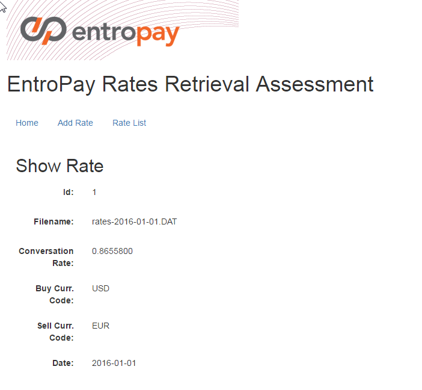

# EntroPay Rates Retrieval Assessment
## Candidate release

### Candidate Name: Pietro Cascio
#### Public Repo: https://github.com/consulbit/RatesRetrievalService

The assessment has been developed based on two branches:
* **master** branch
* **SpringMVC** branch

As required and advised in the specification, the technologies and tools that has been used are the following:
* _Java JDK 1.8+_
* Web container _WildFly 9+_
* Relational Database _H2_ (in-memory instance)
* JPA with Hibernate as persistence layer
* _JSR-352 - Batch Processing_
* _Java EE 7.x_ (for the **master** branch)
* _Spring MVC Framework_ on top of the _Java EE 7.x_ infrastructure (for the **SpringMVC** branch)
* _Bootstrap Framework_ integration
* _Thymeleaf_ template engine
* _jQuery and jQuery UI_ libraries
* _JAX-RS_ specification using the _RestEasy_ engine implementation (shipped with _WildFly 9+_)

## SpringMVC branch
Basically, this branch is the same as the **master** branch with regards to the _"Batch Processing Layer"_, the _"Persistence 
Layer"_ and the _"REST API Layer"_ but with "steroids" on the _"View Layer"_.

### Steroids on the UI
It's been developed a simple view layer adopting the _**Thymeleaf Template Engine**_, the _**Bootstrap Framework**_ and the 
_**jQuery**_ and _**jQuery UI**_ libraries. All of these libraries have been added as _Maven dependencies_ and _WebJars Artifacts_.

Differently from the **master** branch, here it has been created a view layer with UI components to manage the operations 
 specified in the assessment specification guide.
Actually, in this branch has been added support for the _**Spring Boot Framework**_ but it's been disabled the embedded Tomcat artifact to avoid library conflicts with WildFly so it can not be run as a classic Spring Boot application but it has to be deployed into WildFly.
### Home page
It's been created an home page with the opportunity to start the job or directly create a rate item.

### Home page with job started
Once the job has been started, it's possible to see the _**ID**_ assigned to the job and also it's possible to see the result
of the batch job.

### Rate List page
If we go to the _"Rate List"_ page before starting the job or after having removed all the items, it looks like this:  
 
instead, if we go to the page after the job has started and the files have been processed, it shows a list of entry with 
the opportunity to operate on them, for example viewing, modifying or deleting the rate items.  

### View Rate page

### Edit Rate page

### Delete Rate page

### Delete All Rate page

### Add Rate page

